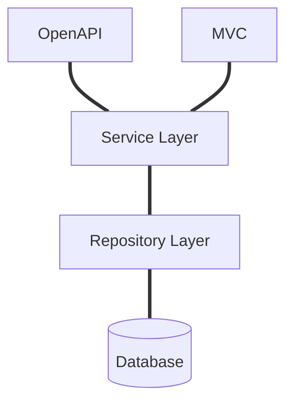

## .NET Project Language Learning Platform
### Overview

A platform for online learning where teachers can create video courses. Students can see all available courses, enroll in the ones they like and rate and comment under the course. Some lectures can have assignments, where each enrolled student can upload submission and receive a grade. 

The theme of the project is Language lessons. :speech_balloon:

---
<br>


Short Preview:

https://youtu.be/xmRGHg01H5w?si=-89dAvzDFa20FVng

### :hammer_and_wrench: Features

- Anonymous users can see the list of all courses
  + Access the course introduction video and see the comments bellow with ratings.
  + They can sort and filter the list of courses
- Users can register as a teacher or a student
- Students can
  + See all that Anonymous users can see
  + Enroll in courses
  + Rate courses (And leave a comment with their rating if they want to)
  + See all lectures in the courses they are enrolled in
  + Download assignments from under lectures 
  + Upload their submission for each assignment under the respective lecture
  + See a list of all courses they are enrolled in in their account page
- Teachers can
  + See a list of all courses they have created
  + Create courses as drafts or directly publish them
  + Add and remove lectures
  + Upload assignment for each lecture as a text file
  + See a list of all assignments that are pending assessment,  
  + Download the submissions and grade them, change the grade at a latter point

### :jigsaw: Technologies Used

- Entity Framework 6.0
- Bootstrap library

- Necessary packages:
  + Microsoft.EntityFrameworkCore Version="6.0.26"
  + Microsoft.AspNetCore.Authentication.JwtBearer Version="6.0.25"
  + Microsoft.AspNetCore.Identity.EntityFrameworkCore Version="6.0.26" 
  + Microsoft.AspNetCore.Mvc.NewtonsoftJson Version="6.0.26"
  + Microsoft.EntityFrameworkCore.Design Version="6.0.26"
  + Microsoft.EntityFrameworkCore.SqlServer  Version="6.0.26"
  + Microsoft.EntityFrameworkCore.Tools Version="6.0.26"
  + Swashbuckle.AspNetCore Version="6.5.0"
  + Swashbuckle.AspNetCore.Newtonsoft Version="6.5.0"
  + Swashbuckle.AspNetCore.Annotations Version="6.5.0"
  + System.IdentityModel.Tokens.Jwt Version="6.35.0"
  + MailKit Version="4.3.0" 
  + NSwag.Annotations Version="14.0.3"
  + DeepL.NET Library Version="1.8.0"
 


### :rocket: Installation
The project generates a database using code-first approach. 

Follow these steps to set up and run the application:

:footprints::one: **Step one**
- Install all necessary packages using the the NuGet Package manager in Visual Studio 2023

- To install them all run in the NuGet Package Manager console:

```
dotnet add package Microsoft.EntityFrameworkCore --version 6.0.26
dotnet add package Microsoft.AspNetCore.Authentication.JwtBearer --version 6.0.25
dotnet add package Microsoft.AspNetCore.Identity.EntityFrameworkCore --version 6.0.26
dotnet add package Microsoft.AspNetCore.Mvc.NewtonsoftJson --version 6.0.26
dotnet add package Microsoft.EntityFrameworkCore.Design --version 6.0.26
dotnet add package Microsoft.EntityFrameworkCore.SqlServer --version 6.0.26
dotnet add package Microsoft.EntityFrameworkCore.Tools --version 6.0.26
dotnet add package Swashbuckle.AspNetCore --version 6.5.0
dotnet add package Swashbuckle.AspNetCore.Newtonsoft --version 6.5.0
dotnet add package Swashbuckle.AspNetCore.Annotations --version 6.5.0
dotnet add package System.IdentityModel.Tokens.Jwt --version 6.35.0
dotnet add package MailKit --version 4.3.0
dotnet add package NSwag.Annotations --version 14.0.3
dotnet add package DeepL.net --version 1.8.0
```

:footprints::two: **Step two**
- Setup the SQL server connection to your computer by creating an appsettings.json file in the root folder of the project
  
:footprints::three:	 **Step three**
- Paste this code in your appsettings.jon file:

```
{
  "AllowedHosts": "*",
  "ConnectionStrings": {
    "DefaultConnection": "Server=DESKTOP-VKFPR8Q\\SQLEXPRESS;Database=VirtualTeacher;Trusted_Connection=True;"
  },
  "Jwt": {
    "Key": "8344d3e3-33ef-48a5-a47d-6af35154e943",
    "Issuer": "SchoolOfHardKnocks.com"
  },

  "EmailHost": "smtp.gmail.com",
  "EmailUsername": "mypolyglotcourse@gmail.com",
  "EmailPassword": "kzoa lirj ohpa ahdc",

  "TranslatorConfig": {
    "AuthKey": "30cc864d-ca3e-4271-954b-414af4218ec8:fx"
  }
}
```

You need to replace ```{{YourServerconnectionString}}``` with your actual SQL connection string. 


:footprints::four: **Step four**
- Open the Package Manager Console and create a new database migration.
```
Add-Migration Initial
```
:footprints::five: **Step five**
- In the console upload the migration
```
Update-Database
```
:footprints::six: **Step six**
- Build the project

:footprints::seven: **Step seven**
- Open it in a browser
The url with the port you are using is set in /Properties/launchSettings.json:
this line:
```"applicationUrl": "http://localhost:5000"```
This is the url you can use to access the site after you have build the project. 

:footprints::eight: **Step eight**
- After the database have been created pull the repository again in order to get the PrivateData directory with the necessary Assignment and Submission files that might have been deleted during the database creation.
<br>
<br>

### Home Page
<br>


### :key: Login Page 
<br>

You can login using any username in the database, the password for all of them is 
An example credentials are:

<br>

<br>


### :key: Register Page 


### :id: Account Page 

After successful login you are redirected to the Account Info page:


## :film_strip: All Courses


### :student: Student View 
<br>

Navigating to "All Courses" for students look like this:

<br/>


### :woman_teacher: Teacher View 
<br/>
Navigating to "All Courses" for teachers look like this.
The users that are in role Teacher see additional functionality on this page.
<br>

They can see the drafts of the courses they haven't published yet ("Drafts" button) or directly sort the list of courses to see only the ones they are teaching ("Courses I am Teaching" button).

<br/>


### :microscope: Filter panel
<br/>

You can filter and sort the Courses by <strong>Teacher</strong> username, <strong>Topic</strong> or <strong>Minimum Rating</strong> or a combination of them.

<br/>


You can also sort the list with the SortBy Button on top by  <strong>Rating</strong> and <strong>Title</strong>.

<br>


<br />

### :window: Course and Lecture view

From the lins with courses, clicking on one of the course titles loads the Course page.
Here you can see the introductory video for the course and enroll in the course. You can give it a rating from 0.5 to 5 and leave a review. 
<br/>


From there (if you are entrolled) you can select a lecture from the list on the left, in this case "Basic Grammar".
Here you can add notes only visible to you and discuss the lecture in the comments below. 
<br/>


### :green_book: Assignments Page 
Assignments Page is visible to Teachers only. 
There they can see all Lectures that have assignments and how many submissions there are for each of these lectures. Lectures without submission have an X on the right-hand side of the list. 

Unassessed lecture show with red icon, and the assessed ones with green checkmark inside the list. 

<br>

<br/>

When the teacher wants to grade the submission then can open the element by clicking on the lecture name. In this case Common Vocabulary:


From the small buttons on the top-right corner of the element they can download the Assignment itself or upload a new one. At the moment Deletion is disabled for Teachers, hence the trashcan button is greyed out. 
However this can be done from the Lecture page.
<br />

### :shield: Admin Panel
<br>

Admins can see a list of all users and promote them to teachers. Students can request to become teachers and admins can approve them or deny the change in their Users panel:

<br>


### :chains: Database Diagram
<br>


<br>

### :deciduous_tree: Solution Structure
The project uses 3 layered structure:

+ Repository layer
+ Service layer
+ Presentation layer and an OpenAPI



:world_map: Detailed Project File Structure:
<details>

  <br>
  <summary>Click to expand/collapse</summary>

  ```
C:.
¦   .gitignore
¦   directory_structure.txt
¦   project_structure.txt
¦   README.md
¦   Virtual Teacher.docx
¦   VirtualTeacher.sln
¦   
L---VirtualTeacher
    ¦   appsettings.Development_.json
    ¦   appsettings.json
    ¦   Program.cs
    ¦   VirtualTeacher.csproj
    ¦   VirtualTeacher.csproj.user
    ¦   
    +---Components
    ¦       AssessSubmissionModal.cs
    ¦       Sidebar.cs
    ¦       TeachersModal.cs
    ¦       
    +---Controllers
    ¦   +---API
    ¦   ¦       AccountApiController.cs
    ¦   ¦       ApplicationApiController.cs
    ¦   ¦       CourseApiController.cs
    ¦   ¦       UsersApiController.cs
    ¦   ¦       
    ¦   L---MVC
    ¦           AccountController.cs
    ¦           ApplicationController.cs
    ¦           AssignmentController.cs
    ¦           CourseController.cs
    ¦           HomeController.cs
    ¦           LectureController.cs
    ¦           RatingController.cs
    ¦           SharedController.cs
    ¦           UserController.cs
    ¦           
    +---Data
    ¦       AppDbContext.cs
    ¦       CommentsData.cs
    ¦       CoursesData.cs
    ¦       CourseStudentData.cs
    ¦       CourseTeacherData.cs
    ¦       LecturesData.cs
    ¦       SubmissionsData.cs
    ¦       UsersData.cs
    ¦       
    +---Exceptions
    ¦       DuplicateEntityException.cs
    ¦       EntityNotFoundException.cs
    ¦       InvalidCredentialsException.cs
    ¦       InvalidUserInputException.cs
    ¦       UnauthorizedOperationException.cs
    ¦       
    +---Helpers
    ¦   ¦   ModelMapper.cs
    ¦   ¦   SwaggerTagsFilter.cs
    ¦   ¦   
    ¦   L---CustomAttributes
    ¦           IsAdminAttribute.cs
    ¦           IsTeacherOrAdminAttribute.cs
    ¦           
    +---Migrations
    ¦       20240221074451_initial.cs
    ¦       20240221074451_initial.Designer.cs
    ¦       AppDbContextModelSnapshot.cs
    ¦       
    +---Models
    ¦   ¦   Comment.cs
    ¦   ¦   Course.cs
    ¦   ¦   Lecture.cs
    ¦   ¦   Note.cs
    ¦   ¦   PaginatedList.cs
    ¦   ¦   Rating.cs
    ¦   ¦   Submission.cs
    ¦   ¦   TeacherApplication.cs
    ¦   ¦   User.cs
    ¦   ¦   
    ¦   +---DTOs
    ¦   ¦   ¦   ApplicationResponseDto.cs
    ¦   ¦   ¦   EmailDto.cs
    ¦   ¦   ¦   LectureTitleIdDto.cs
    ¦   ¦   ¦   
    ¦   ¦   +---Account
    ¦   ¦   ¦       AccountUpdateDto.cs
    ¦   ¦   ¦       CredentialsDto.cs
    ¦   ¦   ¦       UserPasswordDto.cs
    ¦   ¦   ¦       
    ¦   ¦   +---Course
    ¦   ¦   ¦       CommentCreateDto.cs
    ¦   ¦   ¦       CommentResponseDto.cs
    ¦   ¦   ¦       CourseCreateDto.cs
    ¦   ¦   ¦       CourseResponseDto.cs
    ¦   ¦   ¦       CourseUpdateDto.cs
    ¦   ¦   ¦       LectureCreateDto.cs
    ¦   ¦   ¦       LectureResponseDto.cs
    ¦   ¦   ¦       LectureUpdateDto.cs
    ¦   ¦   ¦       RatingCreateDto.cs
    ¦   ¦   ¦       RatingResponseDto.cs
    ¦   ¦   ¦       
    ¦   ¦   L---User
    ¦   ¦           UserCreateDto.cs
    ¦   ¦           UserResponseDto.cs
    ¦   ¦           UserUpdateDto.cs
    ¦   ¦           
    ¦   +---Enums
    ¦   ¦       CourseTopic.cs
    ¦   ¦       UserRole.cs
    ¦   ¦       
    ¦   L---QueryParameters
    ¦           AssignmentsQueryParameters.cs
    ¦           CommentQueryParameters.cs
    ¦           CourseQueryParameters.cs
    ¦           UserQueryParameters.cs
    ¦           
    +---PrivateData
    ¦   +---Assignments
    ¦   ¦   +---course-1
    ¦   ¦   +---course-10
    ¦   ¦   L---course-3
    ¦   ¦           lecture-10.txt
    ¦   ¦           
    ¦   L---Submissions
    ¦       +---course-1
    ¦       ¦   +---lecture-1
    ¦       ¦   ¦       ian_c.txt
    ¦       ¦   ¦       julia_lopez.txt
    ¦       ¦   ¦       
    ¦       ¦   L---lecture-2
    ¦       ¦           ian_c.txt
    ¦       ¦           julia_lopez.txt
    ¦       ¦           
    ¦       L---course-3
    ¦           L---lecture-10
    ¦                   admin.txt
    ¦                   
    +---Properties
    ¦       launchSettings.json
    ¦       serviceDependencies.local.json.user
    ¦       
    +---Repositories
    ¦   ¦   ApplicationRepository.cs
    ¦   ¦   CourseRepository.cs
    ¦   ¦   UserRepository.cs
    ¦   ¦   
    ¦   L---Contracts
    ¦           IApplicationRepository.cs
    ¦           ICourseRepository.cs
    ¦           IUserRepository.cs
    ¦           
    +---Services
    ¦   ¦   AccountService.cs
    ¦   ¦   ApplicationService.cs
    ¦   ¦   CourseService.cs
    ¦   ¦   EmailService.cs
    ¦   ¦   UserService.cs
    ¦   ¦   
    ¦   L---Contracts
    ¦           IAccountService.cs
    ¦           IApplicationService.cs
    ¦           ICourseService.cs
    ¦           IEmailService.cs
    ¦           IUserService.cs
    ¦           
    +---ViewModels
    ¦   ¦   ErrorViewModel.cs
    ¦   ¦   HomeIndexViewModel.cs
    ¦   ¦   
    ¦   +---Account
    ¦   ¦       AccountInfoViewModel.cs
    ¦   ¦       AccountUpdateViewModel.cs
    ¦   ¦       LoginViewModel.cs
    ¦   ¦       PasswordViewModel.cs
    ¦   ¦       RegisterViewModel.cs
    ¦   ¦       
    ¦   +---Assignments
    ¦   ¦       AssignmentsViewModel.cs
    ¦   ¦       
    ¦   +---Courses
    ¦   ¦       CourseCreateViewModel.cs
    ¦   ¦       CoursesListViewModel.cs
    ¦   ¦       CourseUpdateViewModel.cs
    ¦   ¦       
    ¦   +---Lectures
    ¦   ¦       LectureCreateViewModel.cs
    ¦   ¦       LectureUpdateViewModel.cs
    ¦   ¦       
    ¦   L---Users
    ¦           UserIndexViewModel.cs
    ¦           UserUpdateViewModel.cs
    ¦           
    +---Views
    ¦   ¦   _ViewImports.cshtml
    ¦   ¦   _ViewStart.cshtml
    ¦   ¦   
    ¦   +---Account
    ¦   ¦       Index.cshtml
    ¦   ¦       Login.cshtml
    ¦   ¦       Password.cshtml
    ¦   ¦       Register.cshtml
    ¦   ¦       Update.cshtml
    ¦   ¦       
    ¦   +---Assignment
    ¦   ¦       Index.cshtml
    ¦   ¦       
    ¦   +---Course
    ¦   ¦       Create.cshtml
    ¦   ¦       Details.cshtml
    ¦   ¦       Index.cshtml
    ¦   ¦       Update.cshtml
    ¦   ¦       
    ¦   +---Home
    ¦   ¦       Index.cshtml
    ¦   ¦       Privacy.cshtml
    ¦   ¦       
    ¦   +---Lecture
    ¦   ¦       Create.cshtml
    ¦   ¦       Details.cshtml
    ¦   ¦       Update.cshtml
    ¦   ¦       
    ¦   +---Shared
    ¦   ¦   ¦   Error.cshtml
    ¦   ¦   ¦   Success.cshtml
    ¦   ¦   ¦   _DisplayRating.cshtml
    ¦   ¦   ¦   _InteractiveRating.cshtml
    ¦   ¦   ¦   _Layout.cshtml
    ¦   ¦   ¦   _Layout.cshtml.css
    ¦   ¦   ¦   _ValidationScriptsPartial.cshtml
    ¦   ¦   ¦   
    ¦   ¦   L---Components
    ¦   ¦       +---Sidebar
    ¦   ¦       ¦       Index.cshtml
    ¦   ¦       ¦       
    ¦   ¦       L---TeachersModal
    ¦   ¦               Index.cshtml
    ¦   ¦               
    ¦   L---User
    ¦           Index.cshtml
    ¦           Update.cshtml
    ¦           
    L---wwwroot
        ¦   favicon.ico
        ¦   
        +---css
        ¦       site.css
        ¦       
        +---images
        ¦   ¦   avatar-default.jpg
        ¦   ¦   home-temp.png
        ¦   ¦   
        ¦   +---avatars
        ¦   ¦       admin.jpg
        ¦   ¦       brownA.jpg
        ¦   ¦       johndoe.jpg
        ¦   ¦       
        ¦   L---flags
        ¦       ¦   English.jpg
        ¦       ¦   French.jpg
        ¦       ¦   German.jpg
        ¦       ¦   Japanese.jpg
        ¦       ¦   Russian.jpg
        ¦       ¦   Spanish.jpg
        ¦       ¦   
        ¦       L---svgFlags
        ¦               Bulgarian.svg
        ¦               Chinese.svg
        ¦               English.svg
        ¦               French.svg
        ¦               German.svg
        ¦               Japanese.svg
        ¦               Russian.svg
        ¦               Spanish.svg
        ¦               
        +---js
        ¦       site.js
        ¦       
        L---lib
            +---bootstrap
            ¦   ¦   LICENSE
            ¦   ¦   
            ¦   L---dist
            ¦       +---css
            ¦       ¦       bootstrap-grid.css
            ¦       ¦       bootstrap-grid.css.map
            ¦       ¦       bootstrap-grid.min.css
            ¦       ¦       bootstrap-grid.min.css.map
            ¦       ¦       bootstrap-grid.rtl.css
            ¦       ¦       bootstrap-grid.rtl.css.map
            ¦       ¦       bootstrap-grid.rtl.min.css
            ¦       ¦       bootstrap-grid.rtl.min.css.map
            ¦       ¦       bootstrap-reboot.css
            ¦       ¦       bootstrap-reboot.css.map
            ¦       ¦       bootstrap-reboot.min.css
            ¦       ¦       bootstrap-reboot.min.css.map
            ¦       ¦       bootstrap-reboot.rtl.css
            ¦       ¦       bootstrap-reboot.rtl.css.map
            ¦       ¦       bootstrap-reboot.rtl.min.css
            ¦       ¦       bootstrap-reboot.rtl.min.css.map
            ¦       ¦       bootstrap-utilities.css
            ¦       ¦       bootstrap-utilities.css.map
            ¦       ¦       bootstrap-utilities.min.css
            ¦       ¦       bootstrap-utilities.min.css.map
            ¦       ¦       bootstrap-utilities.rtl.css
            ¦       ¦       bootstrap-utilities.rtl.css.map
            ¦       ¦       bootstrap-utilities.rtl.min.css
            ¦       ¦       bootstrap-utilities.rtl.min.css.map
            ¦       ¦       bootstrap.css
            ¦       ¦       bootstrap.css.map
            ¦       ¦       bootstrap.min.css
            ¦       ¦       bootstrap.min.css.map
            ¦       ¦       bootstrap.rtl.css
            ¦       ¦       bootstrap.rtl.css.map
            ¦       ¦       bootstrap.rtl.min.css
            ¦       ¦       bootstrap.rtl.min.css.map
            ¦       ¦       
            ¦       L---js
            ¦               bootstrap.bundle.js
            ¦               bootstrap.bundle.js.map
            ¦               bootstrap.bundle.min.js
            ¦               bootstrap.bundle.min.js.map
            ¦               bootstrap.esm.js
            ¦               bootstrap.esm.js.map
            ¦               bootstrap.esm.min.js
            ¦               bootstrap.esm.min.js.map
            ¦               bootstrap.js
            ¦               bootstrap.js.map
            ¦               bootstrap.min.js
            ¦               bootstrap.min.js.map
            ¦               
            +---font-awesome
            ¦   +---css
            ¦   ¦       all.min.css
            ¦   ¦       
            ¦   L---webfonts
            ¦           fa-brands-400.ttf
            ¦           fa-brands-400.woff2
            ¦           fa-regular-400.ttf
            ¦           fa-regular-400.woff2
            ¦           fa-solid-900.ttf
            ¦           fa-solid-900.woff2
            ¦           fa-v4compatibility.ttf
            ¦           fa-v4compatibility.woff2
            ¦           
            +---jquery
            ¦   ¦   LICENSE.txt
            ¦   ¦   
            ¦   L---dist
            ¦           jquery.js
            ¦           jquery.min.js
            ¦           jquery.min.map
            ¦           
            +---jquery-validation
            ¦   ¦   LICENSE.md
            ¦   ¦   
            ¦   L---dist
            ¦           additional-methods.js
            ¦           additional-methods.min.js
            ¦           jquery.validate.js
            ¦           jquery.validate.min.js
            ¦           
            L---jquery-validation-unobtrusive
                    jquery.validate.unobtrusive.js
                    jquery.validate.unobtrusive.min.js
                    LICENSE.txt
                    

  
  ```
</details>


---

## Contributors
For further information, please feel free to contact us:

| Authors                   | :mailbox_closed:                                                    | :octocat:                                    |
| ------                    | ------                                                      | ------                                      |
| Stanimir Nenkov           | staanimir@gmail.com                        	              | [link](https://github.com/stnmrr)           |
| Tomi Tsolov               | tvtsolov@gmail.com                                          | [link](https://github.com/tvtsolov)         |
| George Halachev           | george.halachev@gmail.com                                   | [link](https://github.com/george-halachev)  |

---
